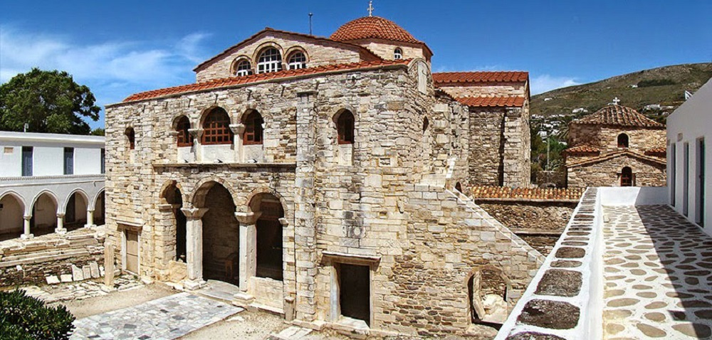

### ***[Video "Παναγία η Εκατονταπυλιανή"](https://youtu.be/ewUgbou5-8s")***

  Ο ναός της Παναγίας της Εκατονταπυλιανής βρίσκεται στην Παροικία, πρωτεύουσα της νήσου Πάρου, σε μικρή απόσταση από το λιμάνι της. Είναι ένας από τους αρχαιότερους και καλύτερα διατηρημένους χριστιανικούς ναούς, που βρίσκονται στην ελεύθερη ελληνική γη.

Yπάρχουν δύο ονομασίες γι' αυτόν το ναό: "Καταπολιανή" και "Εκατονταπυλιανή". Μέχρι πριν λίγα χρόνια, επικρατούσε η άποψη ότι το πραγματικό όνομα του ναού είναι το πρώτο, και τούτο γιατί βρισκόταν "κατά την πόλιν", προς το μέρος δηλαδή της αρχαίας πόλης, και ότι το δεύτερο είναι δημιούργημα των λογίων του 17ου αιώνα, που θέλησαν να δώσουν μ\' αυτό περισσότερη μεγαλοπρέπεια στο ναό. Νεώτερες όμως έρευνες στις πηγές απέδειξαν ότι και οι δύο αυτές ονομασίες είναι σύγχρονες και βρίσκονταν σε παράλληλη χρήση από τα μέσα του 16ου αιώνα. Η ονομασία Καταπολιανή αναφέρεται για πρώτη φορά σε υπόμνημα περί Νάξου και Πάρου του δούκα τα Αρχιπελάγους Ιωάννη Δ΄, του έτους 1562, ενώ η δεύτερη, "Εκατονταπυλιανή", μνημονεύεται σε έγγραφο του Πατριάρχη Θεολήπτου Β΄ του έτους 1586. Σήμερα η επίσημη ονομασία του ναού είναι Εκατονταπυλιανή.

Η παράδοση που διασώζεται μέχρι σήμερα σχετικά με την ονομασία Εκατονταπυλιανή έχει ως εξής: "Ενενήντα εννέα φανερές πόρτες έχει η Καταπολιανή. Η εκατοστή είναι κλειστή και δεν φαίνεται. Θα φανεί η πόρτα αυτή και θα ανοίξει, όταν οι Έλληνες πάρουν την Πόλη"..

