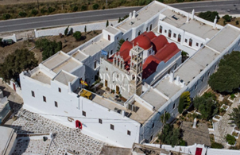

Το ιστορικό μοναστήρι της Παναγίας της Τουρλιανής, που ιδρύθηκε το 1542, βρίσκεται στην Άνω Μερά Μυκόνου και αποτελεί την προστάτιδα του νησιού.

Η ονομασία «Τουρλιανή» οφείλεται σε δύο διαφορετικές εκδοχές. Σύμφωνα με τη μια εκδοχή η θαυματουργή εικόνα της Παναγίας, η οποία επιγράφεται στο ασημένιο πουκάμισό της «Η Εκατονταπυλιανή της Πάρου», βρέθηκε στη θαλάσσια περιοχή Τούρλος έξω από τη Χώρα της Μυκόνου. Σύμφωνα με άλλη εκδοχή η ονομασία «Τουρλιανή» προήλθε από το όνομα μιας μοναχής, της Τούρλης, η οποία ασκήτευσε στην τοποθεσία όπου βρίσκεται σήμερα το μοναστήρι. 

Κατά την εποχή αυτή άρχισαν να κτίζονται και τα πρώτα κελιά από δύο μοναχούς, που έφυγαν το 1537 από την Πάρο για να προστατευθούν από τους πειρατές και έφτασαν στη Μύκονο, αναζητώντας τόπο ήρεμο και ασφαλή μακριά από τη θάλασσα. Στον τόπο αυτό, όπου προϋπήρχε μικρός ναός των Εισοδίων της Θεοτόκου, ιδρύθηκε το ιστορικό μοναστήρι της Παναγίας της Τουρλιανής, στο οποίο μεταφέρθηκε για λόγους ασφαλείας η θαυματουργή εικόνα της Υπεραγίας Θεοτόκου, που βρέθηκε στα παράλια του νησιού και αποτελεί τον ανεκτίμητο πνευματικό θησαυρό των Μυκονίων.
