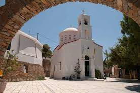

Εκκλησία Της Παναγίας Κανάλας στην Κύθνο είναι χτισμένη σε μια από τις ωραιότερες, πευκόφυτες ακρογιαλιές του νησιού, εδώ φυλάσσεται η Θαυματουργός Εικόνα Της Παναγίας Κανάλας.

Ο θρύλος για την εύρεση της Εικόνας αναφέρει, ότι μια έναστρη νύχτα κάποιοι ψαράδες ψάρευαν με βάρκα στον όρμο της Κανάλας. Θαύμαζαν την ψαριά τους, σταυροκοπιόντουσαν και αναρωτιόνταν αν ήταν θαύμα, καθώς έβγαζαν συνέχεια όλο και περισσότερα ψάρια. Εκεί που τραβούσαν τα παραγάδια και σιγά-σιγά η βάρκα έφτανε προς τα βράχια, ένας από τους ψαράδες αντίκρισε φως κοντά στην ακτή. Φοβήθηκαν και βιάστηκαν να βγάλουν τα παραγάδια και να φύγουν, όμως εκείνα κάπου σκάλωσαν και ήταν αδύνατο να μετακινηθούν.
Ζήτησαν λοιπόν τη βοήθεια Της Παναγιάς. Το φως που έβλεπαν έγινε τότε ανέσπερο και έλαμψε δυνατά. Τα παραγάδια λευτερώθηκαν, αλλά εκείνοι δεν έφευγαν, σαν κάτι να τους ωθούσε προς το φως. Πλησίασαν και το είδαν να βγαίνει μέσα από το βυθό σαν πύρινη φλόγα και πλάι του ένα πλατύ ξύλο. Ανέσυραν το ξύλο και η Παναγιά, γλυκιά, παρουσιάστηκε ζωγραφισμένη εκεί πάνω του.
