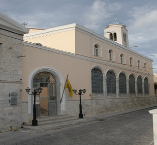

Στο Ναό βρίσκεται και η εικόνα Κοιμήσεως της Θεοτόκου, έργον του Δομίνικου Θεοτοκόπουλου ( El Greco ).

Η εικόνα είναι έργο του 1562-64, μεταξύ των πρώτων έργων του Θεοτοκόπουλου σε ηλικία 19-22 ετών. Βυζαντινής τεχνοτροπίας, Κρητικής Σχολής. Η υπογραφή του βρίσκεται στη βάση του μεσαίου κηροπηγίου, "ΔΟΜΗΝΙΚΟΣ ΘΕΟΤΟΚΟΠΟΥΛΟΣ Ο ΔΕΙΞΑΣ". Στο Ναό βρίσκεται από το 1850 περίπου.
