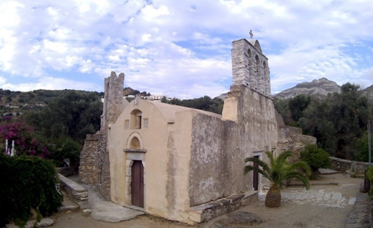

Ένα από τα αρχαιότερα μοναστήρια όχι μόνο της Νάξου και της Ελλάδας, αλλά και ολόκληρων των Βαλκανίων, χρονολογείται από τον 6ο αιώνα και συναντάται στο στο βόρειο άκρο της κοιλάδας της Δρυμαλίας.

Πρόκειται για την ιστορική μονή της Παναγίας Δροσιανής, του μοναστηριού που είναι αφιερωμένο στην Παναγία της βροχής. Σύμφωνα με την τοπική παράδοση προκειμένου να ξορκίσουν την ανομβρία που ταλάνιζε το νησί για μεγάλο χρονικό διάστημα, οι πιστοί Ναξιώτες απευθύνθηκαν στην Παναγία με τάματα και λειτουργίες για να βρέξει έτσι ώστε να μην ξεραθούν οι μπαξέδες και τα δέντρα των κατοίκων του νησιού, το μεγαλύτερο μέρος των οποίων ασχολούνταν κατεξοχήν με τις αγροτικές εργασίες.
