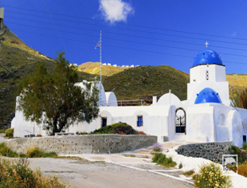

### ***[Video "Παναγία του Καλού"](https://youtu.be/BMrak4TUChI)***

Η Παναγία του Καλού (Κοίμηση της Θεοτόκου) βρίσκεται πολύ κοντά στο ανατολικό κομμάτι του νησιού. Χτίστηκε όταν ολοκληρώθηκε η ηφαιστειακή δραστηριότητα(το ‘μεγάλο Κακό’) της περιόδου 1649-1650 μ.Χ., η οποία οδήγησε στην εμφάνιση του υποθαλάσσιου ηφαιστείου Κολούμπο.  
