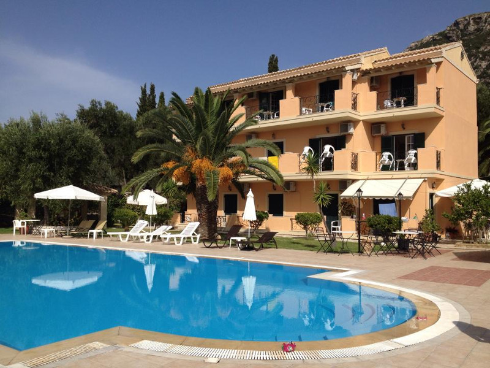

Το Μοναστήρι της Παναγίας της Χοζοβιώτισσας θα το βρεις «κρεμασμένο» πάνω σε έναν απότομο βράχο και από κάτω το απέραντο γαλάζιο της Αγίας Άννας. Το Μοναστήρι της Παναγίας της Χοζοβιώτισσας στέκει εκεί κατάλευκο από το 1088 που ιδρύθηκε. Αφορμή για το χτίσιμό του στάθηκε η εύρεση μιας εικόνας από το Χόζοβο ή Χόζοβα της Παλαιστίνης. Η τοποθεσία Χόζιβα ή Κοζιβά βρίσκεται στους Άγιους τόπους κοντά στην Ιεριχώ.

Η παράδοση λέει πως μια γυναίκα στην Ασία την περίοδο της εικονομαχίας έριξε την εικόνα της Παναγίας στην θάλασσα για να μην καταστραφεί.  Η εικόνα έφτασε στην Αγία Άννα και οι νησιώτες μόλις την βρήκαν αποφάσισαν να φτιάξουν μια εκκλησία εκεί. Όσο κι αν προσπάθησαν όμως δεν τα κατάφεραν. Την ημέρα έχτιζαν, το βράδυ γκρεμίζονταν. Όλοι απογοητεύτηκαν και τότε ο πρωτεργάτης ζήτησε από την Παναγία να του υποδείξει Εκείνη έναν τόπο όπου ήθελε να χτιστεί το Μοναστήρι. Την επόμενη ημέρα πάνω σε έναν απόκρημνο βράχο, πολύ ψηλά ήταν καρφωμένη η σμίλα με το ζεμπίλι και όλα τα εργαλεία του πρωτομάστορα δείγμα πως εκεί ήθελε να ανεγερθεί ο Ναός. Το καρφί του πρωτομάστορα έμεινε καρφωμένο στο βράχο μέχρι το 1956 χρονιά κατά την οποία άρχισε η απαλλοτρίωση των κτιρίων του Μοναστηριού. Τότε έπεσε στην αυλή του Μοναστηριού και οι πιστοί θεώρησαν πως το γεγονός αυτό είναι σημάδι αντίδρασης της Παναγίας στην απαλλοτρίωση. Η σμίλα βρίσκεται σήμερα σε προθήκη στην Εκκλησία της Μονής.
