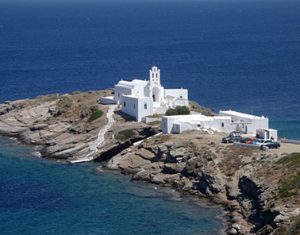

### ***[Video "Η ιστορία της Παναγίας της Χρυσοπηγής"](https://youtu.be/GbPIFDO_c6Q)***

Το μοναστήρι της Παναγιάς της Χρυσοπηγής αποτελεί κατά πολλούς το πιο δημοφιλές αξιοθέατο της Σίφνου. Βρίσκεται στο βραχώδες ακρωτήρι που «κόβει στα δυο» τον όρμο του Φάρου, στη νοτιανατολική πλευρά του νησιού.

Η Παναγιά η Χρυσοπηγή χτισμένη τον 16ο μ.Χ αιώνα αποτελεί σημείο αναφοράς του κυκλαδίτικου νησιού. Φημίζεται για το κάτασπρο χρώμα της και για το μεγάλο πανηγύρι της, που πραγματοποιείται κάθε χρόνο της Αναλήψεως.

Σύμφωνα με την τοπική παράδοση, το εκκλησάκι χτίστηκε σε αυτό το σημείο για να στεγάσει την θαυματουργή εικόνα της Παναγιάς της Ζωοδόχου Πηγής που βρήκαν ψαράδες στη θάλασσα.

Η Μονή της Παναγιάς της Χρυσοπηγής είναι μετόχι του μοναστηριού της Βρυσιανής από το 1760. Όπως λέγεται, οφείλει το όνομά της στον καλόγερο Παρθένο Χαιρέτη, εφημέριο της μονής του Αγίου Ιωάννη του Θεολόγου του Μονγκού, ο οποίος την ονόμασε έτσι σε ανάμνηση της μονής Χρυσοπηγής Χανιών στην οποία ασκήτεψε πριν έρθει στη Σίφνο.

Ο βράχος στον οποίο είναι χτισμένη η Παναγιά η Χρυσοπηγή είναι αποκομμένος από την στεριά και ενώνεται μαζί της μέσω μιας μικρής γέφυρας. Σύμφωνα με τη λαϊκή παράδοση, η Παναγία ανταποκρινόμενη στο κάλεσμα μιας καλόγριας να την σώσει από επίθεση πειρατών, «έσκισε» το βράχο στα δυο.

Μία άλλη εκδοχή της ιστορίας, λέει πως όταν οι καλόγριες της μονής πήγαν να ανάψουν τα καντήλια στην εκκλησία, αντιλήφθηκαν τους πειρατές που κοιμόντουσαν εκεί. Ένας πειρατής ξύπνησε από τη μυρωδιά του λιβανιού και αφού σήκωσε και τους υπόλοιπους κυνήγησαν τις καλόγριες. Η Παναγία, για να τις προστατέψει, χώρισε τον βράχο, εμποδίζοντας τους πειρατές να πιάσουν τις γυναίκες.

